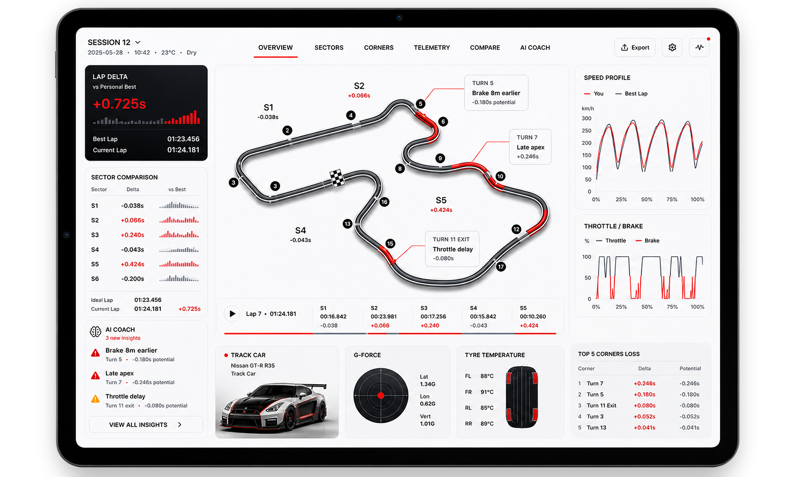

# AI-Assisted Motorsport Coaching Tool 🏁

> A coaching product where AI was not the point. The point was helping drivers understand performance well enough to change behavior.

## Snapshot

| Dimension | Detail |
| --- | --- |
| Product type | AI-assisted motorsport coaching |
| Users | Drivers with different skill levels and feedback needs |
| Core problem | Turning telemetry into trusted, actionable coaching |
| Main constraint | Hardware, software, data quality, and open-source model limits |
| My edge | Technical fluency plus data interpretation |

## Product Tension

| Signal | Risk | PM Move |
| --- | --- | --- |
| Raw telemetry | Data looks objective but may not be useful | Interpret what the signal actually means |
| Open-source AI models | Model capability can shape the product too much | Keep coaching value ahead of model novelty |
| Driver feedback | Different users need different levels of explanation | Adapt concepts to skill, context, and behavior |
| Hardware constraints | Measurement limits can weaken the experience | Connect feasibility to product scope early |

## Decision / Tradeoff / Outcome

| Decision | Tradeoff | Outcome |
| --- | --- | --- |
| Treat AI as a coaching mechanism, not the product promise. | Some technically interesting model ideas were less important than explainable driver feedback. | The concept stayed focused on helping drivers understand where time was lost and what to try next. |

## What Made It Hard

- Hardware constraints affected what could be measured reliably.
- Software constraints affected latency, analysis, and product experience.
- Open-source AI models created practical limits and tradeoffs.
- Different drivers needed different kinds of feedback.
- The data required visualization and interpretation before it could become a feature.

## My Contribution

- Helped connect driver needs with what the hardware and software could realistically support.
- Tested software options and evaluated where they created value or unnecessary complexity.
- Interpreted performance metrics instead of treating raw telemetry as self-explanatory.
- Used distribution analysis and visualization to identify meaningful performance patterns.
- Helped translate technical findings into feature opportunities and coaching concepts.

## Skills Demonstrated

`Technical product management` · `AI product framing` · `Data interpretation` · `Metrics analysis` · `Hardware/software constraints` · `Expert-user discovery`

## Product Judgment

AI only mattered if it helped explain what happened, why it happened, and what the driver should try next. The product was coaching. AI was one possible mechanism.
