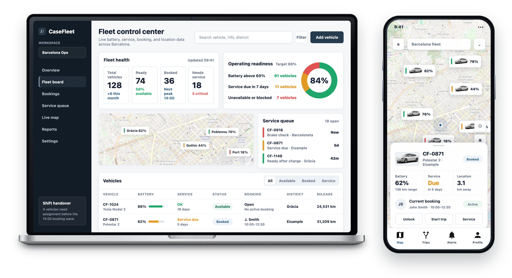

# Fleet Management Launch and Adoption 🚗

> A white-label shared-fleet product where the hard part was not only launch. It was building an adoption system with economics that could scale.

## Snapshot

| Dimension | Detail |
| --- | --- |
| Product type | White-label fleet-management platform |
| Use case | Shared fleet operations |
| Core problem | Scaling adoption without custom work exploding cost |
| Main constraint | CAC, onboarding effort, budget logic, and operational complexity |
| My edge | Connecting product launch to growth economics |

## Product Tension

| Area | Risk | PM Move |
| --- | --- | --- |
| White-label setup | Every customer becomes a custom implementation | Push toward repeatable onboarding patterns |
| Shared-fleet operations | Product value gets buried under operational complexity | Clarify workflows, roles, and value moments |
| Customer acquisition | Growth looks attractive until CAC is counted | Tie adoption strategy to budget logic |
| Launch | Delivery is mistaken for success | Treat launch, usage, retention, and expansion as one system |

## Decision / Tradeoff / Outcome

| Decision | Tradeoff | Outcome |
| --- | --- | --- |
| Frame launch around repeatable onboarding and adoption economics, not only feature delivery. | Some customer-specific flexibility had to be weighed against cost-to-serve and operational scalability. | The product story became easier to connect to CAC, budget justification, and expansion potential. |

## What Made It Hard

- Shared-fleet operations have many moving parts: availability, access, maintenance, support, utilization, and reporting.
- White-label products need configurability without becoming expensive to launch every time.
- Growth depends on onboarding, sales motion, operating cost, and customer success.
- Budget had to be justified against a realistic acquisition and adoption model.

## My Contribution

- Worked on launch and adoption thinking for a shared-fleet management product.
- Helped frame the product around scalable customer onboarding rather than one-off implementation.
- Considered CAC, budget justification, and the operational cost of growth.
- Looked at how the product could support adoption through clearer workflows, stronger value communication, and repeatable launch patterns.

## Skills Demonstrated

`Product launch` · `Adoption strategy` · `Growth thinking` · `CAC reasoning` · `B2B platform positioning` · `White-label constraints`

## Product Judgment

A product can be technically valid and still fail commercially if adoption is too expensive. For this kind of platform, PM work is not only defining features. It is making the product scalable to sell, launch, support, and expand.
