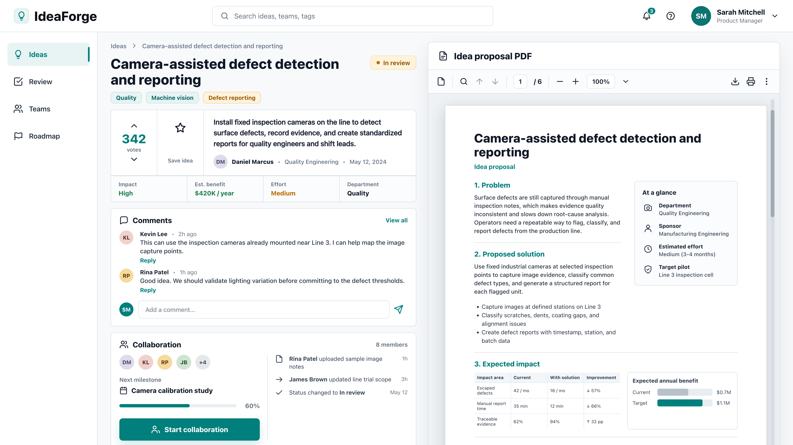

# Internal Innovation Platform 🧩

> An internal innovation platform where employees needed a clear way to submit detailed ideas, discuss them, vote on the strongest proposals, and collaborate on execution. The hard part was balancing that user workflow against broad stakeholder requirements that could easily have made the product too complex.

## Snapshot

| Dimension | Detail |
| --- | --- |
| Product type | Internal innovation platform |
| Audience | Thousands of employees |
| Core problem | Turning broad stakeholder requirements into a focused employee workflow |
| Main constraint | Stakeholder ambition vs. employee clarity and adoption |
| My edge | Balancing user needs, stakeholder priorities, and product scope |

## Platform Functionality

- Employees could submit detailed innovation ideas with enough context for review.
- Other employees could comment, ask questions, and add practical execution input.
- Voting helped surface the ideas employees believed were most valuable.
- Collaboration features helped move selected ideas from proposal to execution with visible ownership and progress.

## Product Tension

| Input | Risk | PM Move |
| --- | --- | --- |
| Stakeholder requests | Building for politics instead of users | Balance stakeholder interests against user value |
| Idea submission | Creating a suggestion box with no follow-through | Design around the full idea lifecycle |
| Comments and voting | Turning engagement into noise or popularity | Use participation as prioritization signal, not the only decision rule |
| Collaboration | Collecting ideas without helping teams execute | Make ownership, progress, and next steps visible |
| User interviews | Taking stated preferences too literally | Separate what people say from what their workflow needs |

## Decision / Tradeoff / Outcome

| Decision | Tradeoff | Outcome |
| --- | --- | --- |
| Keep the platform centered on the employee idea lifecycle: submit, discuss, vote, and collaborate. | Some stakeholder reporting and governance ideas had to stay secondary to the core workflow. | The product direction stayed understandable for employees while still giving stakeholders a structured way to evaluate ideas. |

## What Made It Hard

- Employees needed more than a place to submit ideas. They needed discussion, voting, collaboration, and a credible path to execution.
- Many stakeholders had reasonable but conflicting requirements, each tied to their own governance, reporting, or adoption goals.
- Adding every requested feature would have made the platform harder for employees to understand and use.
- The platform had to serve a large employee base without becoming generic or process-heavy.
- Interviews and surveys needed interpretation, not transcription.
- Secondary research had to inform decisions, not sit in a slide deck.

## My Contribution

- Balanced stakeholder input without treating every request as equal.
- Helped protect the core employee workflow: submit a detailed idea, discuss it, vote on it, and collaborate on execution.
- Interviewed users to understand workflow, motivation, and friction.
- Interpreted survey results with attention to sample limitations and respondent bias.
- Used secondary research to understand comparable internal innovation models.
- Helped frame prioritization around user value, feasibility, stakeholder needs, and platform adoption.

## Skills Demonstrated

`Feature prioritization` · `Stakeholder management` · `Requirements balancing` · `User interviews` · `Survey interpretation` · `Internal platforms`

## Product Judgment

The strongest PM move in this project was resisting the idea that satisfying every stakeholder request would make the platform stronger. For an internal innovation platform, credibility comes from clarity: employees need to understand how to contribute, how others can engage with their idea, and what happens after an idea gains support.
