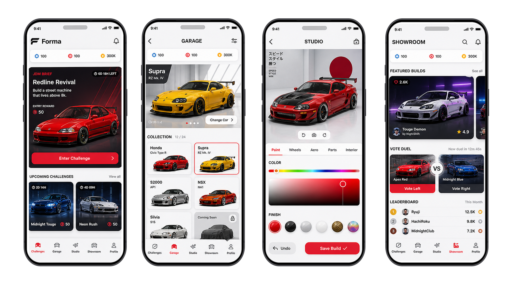

# Mobile Game Monetization Exploration 🎮

> A freemium mobile game concept connected to cars and driving. The question was simple to ask and hard to answer: what can become revenue without damaging the game?

## Snapshot

| Dimension | Detail |
| --- | --- |
| Product type | Freemium mobile game |
| Theme | Car customization and driving |
| Core problem | Usage did not automatically create willingness to pay |
| Main constraint | Monetization had to fit the experience, not interrupt it |
| My edge | User-needs exploration plus business-model thinking |

## Product Tension

| Input | Risk | PM Move |
| --- | --- | --- |
| Freemium engagement | Users play but do not pay | Identify value moments worth charging for |
| Customization | Cosmetic features can feel shallow | Connect customization to identity, progression, or mastery |
| Game mechanics | Engagement loop may not map to revenue | Explore monetization paths before committing |
| User motivation | Payment can damage trust if it feels forced | Protect the core experience while testing business logic |

## Decision / Tradeoff / Outcome

| Decision | Tradeoff | Outcome |
| --- | --- | --- |
| Explore monetization around value moments that fit identity, progression, or mastery. | Some obvious monetization options risked interrupting the game loop or weakening trust. | The product framing moved from "how do we charge?" to "what value is strong enough to deserve payment?" |

## What Made It Hard

- Freemium products can generate usage without proving willingness to pay.
- Game mechanics can create engagement that does not translate into revenue.
- Users may reject monetization if it feels disconnected from the core experience.
- The product needed exploration before committing to a business model.

## My Contribution

- Explored how the game could move from free engagement to credible monetization.
- Looked at user needs, motivation, and behavior rather than only feature ideas.
- Considered different monetization paths and how each would affect the experience.
- Helped frame the problem as product discovery: what value is strong enough to justify payment?

## Skills Demonstrated

`Monetization discovery` · `Freemium product thinking` · `User-needs exploration` · `Creative product framing` · `Business-model evaluation` · `Mobile product thinking`

## Product Judgment

Monetization is a product decision, not a pricing layer. If users do not understand the value, the revenue model will feel forced. The work is to find the part of the experience that is both useful enough and motivating enough to sustain payment.
